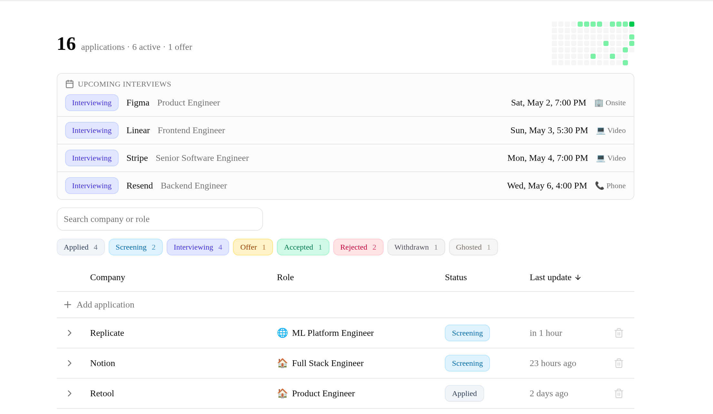
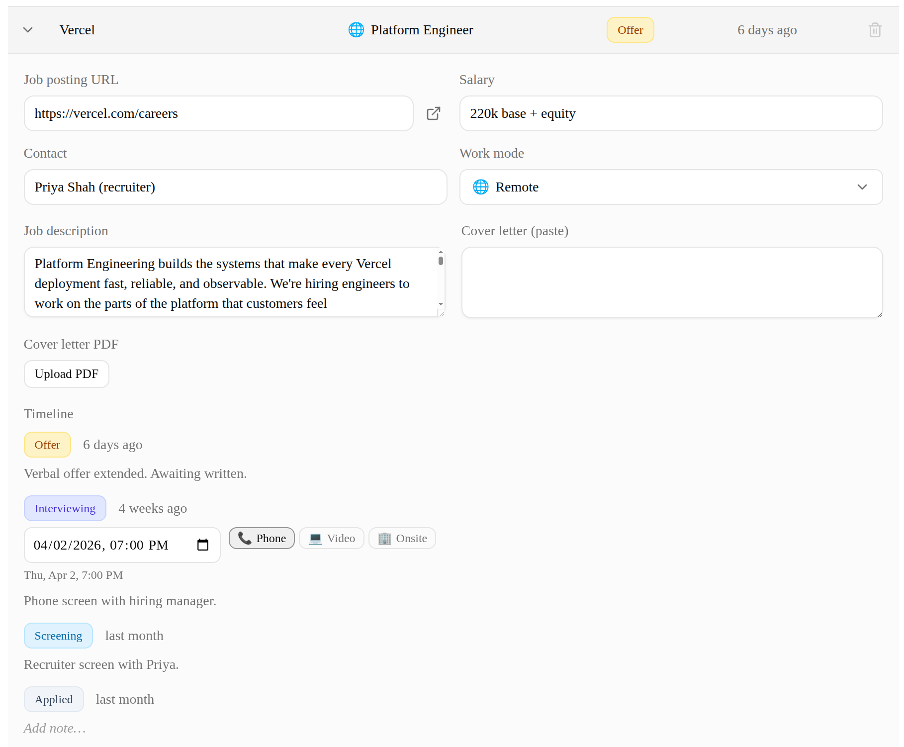
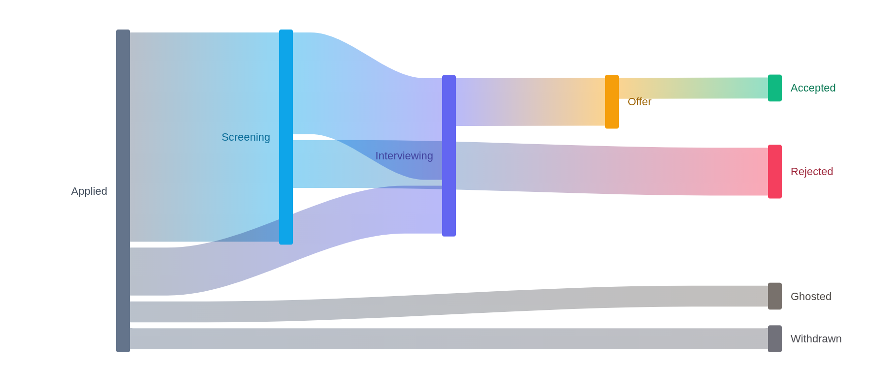

<p align="center">
  <picture>
    <source media="(prefers-color-scheme: dark)" srcset="public/logo-dark.svg">
    
  </picture>
</p>

<h1 align="center">Ghost Hunter</h1>

<p align="center">A job-application tracker.</p>

<p align="center">
  <a href="https://ghosthunter.up.railway.app/"><strong>ghosthunter.up.railway.app →</strong></a>
</p>

<p align="center">
  <a href="https://ghosthunter.up.railway.app/">
    
  </a>
</p>

<p align="center">
  
</p>

## What it tracks

Per application: company, role, salary, work mode, job URL, job description, contact, the resume PDF and cover letter you sent, and a timeline of status changes (applied → screening → interviewing → offer / accepted / rejected / withdrawn / ghosted). Interview events additionally store a date/time and format (phone / video / onsite).

## Features

A sortable, filterable table backs the dashboard. Search by company or role, narrow by status, edit fields inline. Typing a company name in the new-application form filters the table to existing entries at that company.

Each row expands into a detail view with the full field set and an event timeline. Every status change becomes an event with an optional note.

<p align="center">
  
</p>

A Sankey diagram shows how applications transition between statuses; searching highlights the matching paths and mutes the rest. A 90-day heatmap on the stats row shows daily application volume.

<p align="center">
  
</p>

## Tech stack

| Layer     | Choice                                                                                                       |
| --------- | ------------------------------------------------------------------------------------------------------------ |
| Framework | [Next.js 16](https://nextjs.org) (App Router, Server Actions)                                                |
| UI        | [Tailwind CSS v4](https://tailwindcss.com), [shadcn/ui](https://ui.shadcn.com), [Lucide](https://lucide.dev) |
| Database  | PostgreSQL + [Drizzle ORM](https://orm.drizzle.team)                                                         |
| Auth      | [Clerk](https://clerk.com)                                                                                   |
| Charts    | [@nivo/sankey](https://nivo.rocks/sankey); custom SVG heatmap                                                |
| Hosting   | [Railway](https://railway.com) — Next.js, Postgres, bucket storage                                           |

## Architecture notes

- Every query against `applications` and `application_events` filters by `user_id`. The denormalized `user_id` on events skips a join.
- Resumes and cover letters live in Railway buckets via signed URLs; Postgres stores keys + metadata.
- Forward-only Drizzle migrations. Railway runs `drizzle-kit migrate` as a release step before traffic switches.

## Local development

```bash
cp .env.example .env.local      # paste Clerk keys
pnpm install
docker compose up -d             # local Postgres
pnpm db:migrate
pnpm dev                         # http://localhost:3000
```

Requires Node 20+, pnpm, Docker.

| Command                     | Purpose                                     |
| --------------------------- | ------------------------------------------- |
| `pnpm dev`                  | Dev server                                  |
| `pnpm build` / `pnpm start` | Production build / serve                    |
| `pnpm lint`                 | ESLint                                      |
| `pnpm test`                 | Vitest (needs the local Postgres container) |
| `pnpm db:generate`          | Generate a migration from schema changes    |
| `pnpm db:migrate`           | Apply pending migrations                    |
| `pnpm db:studio`            | Drizzle Studio                              |
| `pnpm format`               | Prettier                                    |
